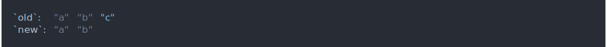
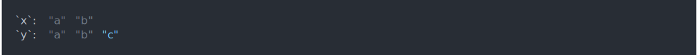
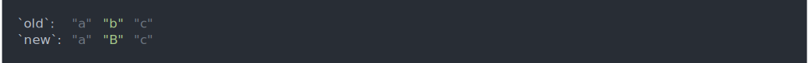
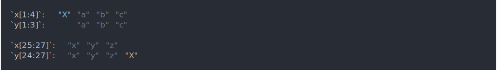
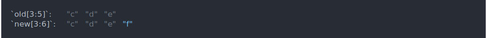
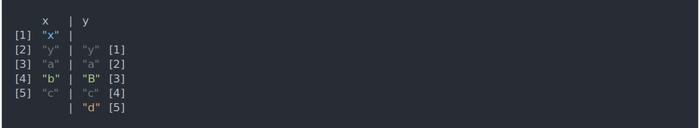
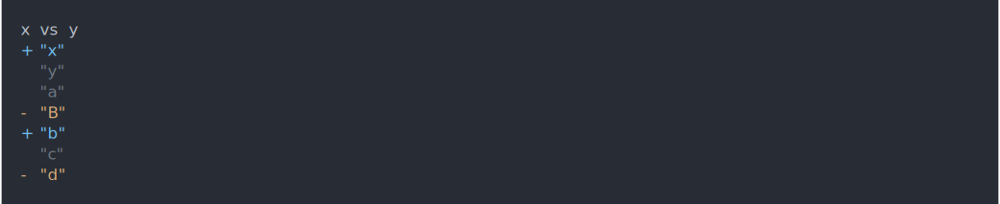

<!-- README.md is generated from README.Rmd. Please edit that file -->

# waldo

<!-- badges: start -->

[](https://codecov.io/gh/r-lib/waldo?branch=master)
[](https://github.com/r-lib/waldo/actions)
<!-- badges: end -->

The goal of waldo is to find and concisely describe the difference
between a pair of R objects. It’s designed specifically to deliver
actionable insights to figure out what’s gone wrong in your unit tests.

`waldo::compare()` is inspired by `all.equal()`, but takes additional
care to generate actionable insights by:

  - Displaying diffs of atomic vectors.
  - Using R code (not a text description) to show where differences
    arise.
  - Where possible, comparing elements by name, rather than by position.

<!--
## Installation

You can install the released version of waldo from [CRAN](https://CRAN.R-project.org) with:

``` r
install.packages("waldo")
```
-->

## Example

``` r
library(waldo)
```

When comparing atomic vectors, `compare()` produces inline diffs (thanks
to [diffobj](https://github.com/brodieG/diffobj)) that show the key
differences, along with a little context:

  - Change
    
    ``` asciicast
    compare(c("a", "b", "c"), c("a", "B", "c"))
    ```
    
    

  - Addition
    
    ``` asciicast
    compare(c("a", "b"), c("a", "b", "c"))
    ```
    
    

  - Deletion
    
    ``` asciicast
    compare(c("a", "b", "c"), c("a", "b"))
    ```
    
    

  - Long vectors with small differences only show local context around
    changes, not everything that’s the same.
    
    ``` asciicast
    compare(c("X", letters), c(letters, "X"))
    ```
    
    

(When run in the console, not in `.Rmd`, colour is used to make the
diffs easier to read)

When comparing more complex objects, `compare()` creates an executable
code path telling you where the differences lie:

``` asciicast
compare(list(a = factor("x")), list(b = 1L))
```



``` asciicast
df1 <- data.frame(x = 1:3, y = 3:1)
df2 <- tibble::tibble(rev(df1))
compare(df1, df2)
```



``` asciicast
x <- list(a = list(b = list(c = list(structure(1, e = 1)))))
y <- list(a = list(b = list(c = list(structure(1, e = "a")))))
compare(x, y)
```


