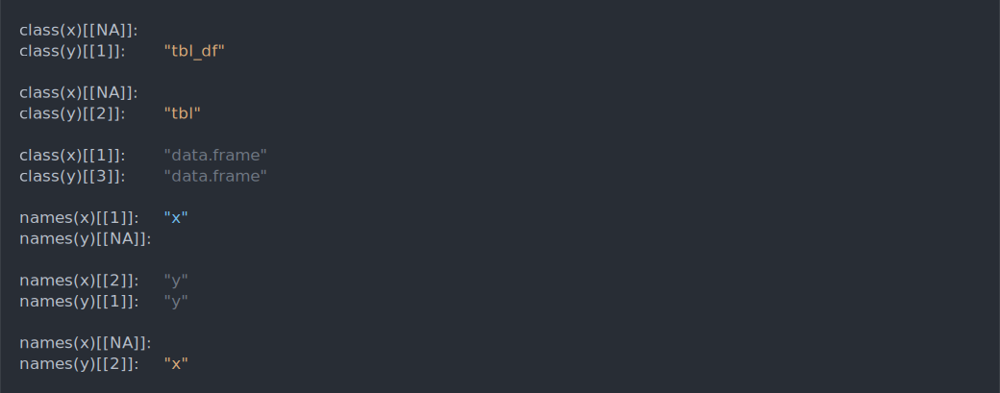
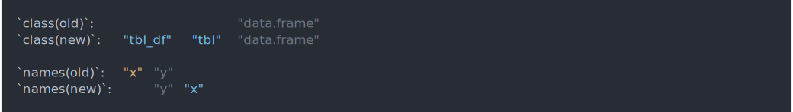
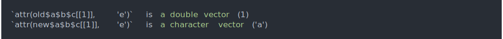

<!-- README.md is generated from README.Rmd. Please edit that file -->

# waldo

<!-- badges: start -->

[](https://app.codecov.io/gh/r-lib/waldo?branch=main)
[](https://github.com/r-lib/waldo/actions/workflows/R-CMD-check.yaml)
<!-- badges: end -->

The goal of waldo is to find and concisely describe the difference
between a pair of R objects, with the primary goal of making it easier
to figure out what’s gone wrong in your unit tests.

`waldo::compare()` is inspired by `all.equal()`, but takes additional
care to generate actionable insights by:

- Ordering the differences from most important to least important.
- Displaying the values of atomic vectors that are actually different.
- Carefully using colour to emphasise changes (while still being
  readable when colour isn’t available).
- Using R code (not a text description) to show where differences arise.
- Where possible, comparing elements by name, rather than by position.
- Erring on the side of producing too much output, rather than too
  little.

## Installation

You can install the released version of waldo from
[CRAN](https://CRAN.R-project.org) with:

``` r
install.packages("waldo")
```

## Comparisons

``` r
library(waldo)
```

When comparing atomic vectors, `compare()` produces diffs (thanks to
[diffobj](https://github.com/brodieG/diffobj)) that highlight additions,
deletions, and changes, along with a little context:

- Deletion

  ``` r
  compare(c("a", "b", "c"), c("a", "b"))
  ```

  

- Addition

  ``` r
  compare(c("a", "b"), c("a", "b", "c"))
  ```

  

- Change

  ``` r
  compare(c("a", "b", "c"), c("a", "B", "c"))
  ```

  

- Long vectors with short differences only show local context around
  changes, not everything that’s the same.

  ``` r
  compare(c("X", letters), c(letters, "X"))
  ```

  

Depending on the relative size of the differences and the width of your
console you’ll get one of three displays:

- The default display is to show the vectors one atop the other:

  ``` r
  compare(letters[1:5], letters[1:6])
  ```

  

- If there’s not enough room for that, the two vectors are shown
  side-by-side:

  ``` r
  options(width = 20)
  compare(letters[1:5], letters[1:6])
  ```

  

- And if there’s still not enough room for side-by-side, the each
  element is given its own line:

  ``` r
  options(width = 10)
  compare(letters[1:5], letters[1:6])
  ```

  

When comparing more complex objects, waldo creates an executable code
path telling you where the differences lie:

- Unnamed lists are compared by position:

  ``` r
  compare(list(factor("x")), list(1L))
  ```

  

- Named lists, including data frames, are compared by name. For example,
  note that the following comparison reports a difference in the class
  and names, but not the values of the columns.

  ``` r
  df1 <- data.frame(x = 1:3, y = 3:1)
  df2 <- tibble::tibble(rev(df1))
  compare(df1, df2)
  ```

  

- Recursion can be arbitrarily deep:

  ``` r
  x <- list(a = list(b = list(c = list(structure(1, e = 1)))))
  y <- list(a = list(b = list(c = list(structure(1, e = "a")))))
  compare(x, y)
  ```

  
